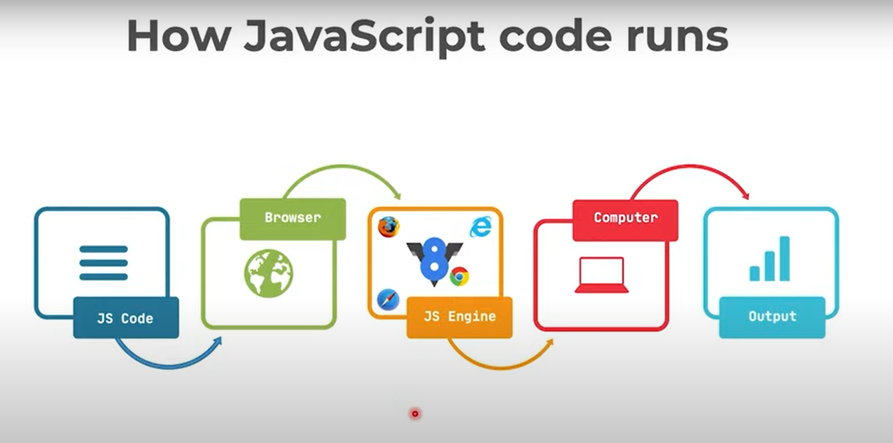
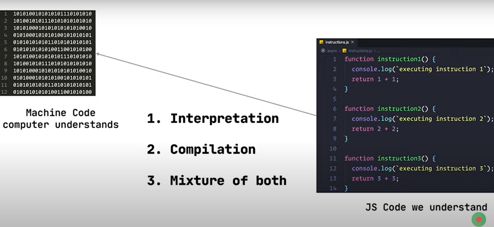
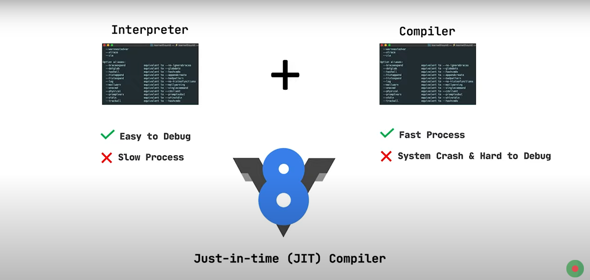
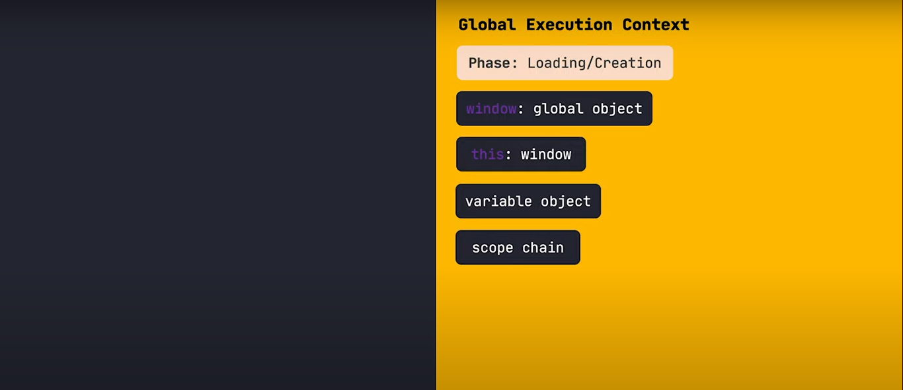
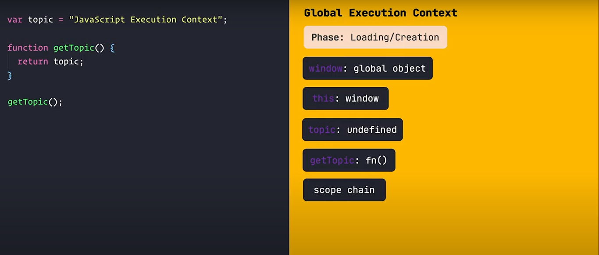
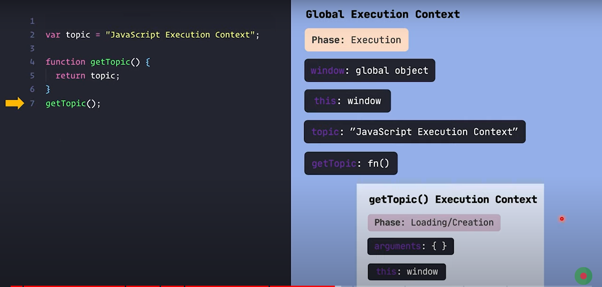

# How to execute javascript in browser

 আমরা যখন js code লিখি তা ব্রাউজারে থাকা বিভিন্ন compailer এ compiled হয়ে machine code এ রুপান্তর হয় তখন আমাদের কম্পিউটার এই code বুঝতে পারে এবং আমাদের output দেখায়। এইটা হচ্ছে সাধারন ভাবে কিভাবে js code ব্রাউজারে দেখায় তা।
 কিন্তু এই কোড ব্রাউজারের ইঞ্জিনে কিভাবে compiled হয় তা আমরা এখন দেখবো।
 
 javascript code শুরুতে interpretaion এ কাজ করতো। intrepretation হলো প্রতি লাইন বাই লাইন কোডকে machine code এ কনভার্ট করা। কিন্তু এই process এ exection করলে অনেক slow কাজ করে। আর compilatin process এ সব কোড গুলা একবারে নিয়ে machine code এ কোনভার্ট করে ফেলে। এবং একসাথে সব run করে দেয়। এতে অনেক তারাতারি compiled হলেও debag করা খুব কঠিন হয়ে যায়। তখন গুগলের ব্রাউজার v8 engine তৈরি করে এই দুই পদ্ধতি কে একসাথে করে। একে JIT-compiler বলা হয়।
  
 আমরা যখন কোনো function call করি তখন JIT-compiler এই পুরো function কে just in time compiled করে run করে দেয়।
 js code exection করার সময় পুরা কোডকে পার্ট বাই পার্ট ভেঙ্গে তারপর compile করা হয়। এই ছোট ছোট পার্টকেই execution context বলে।
 
js Execution হয় দুই ভাবে প্রথমে global execution contex তারপর function execution context.
golbal execution context এ দুইটি phase থাকে। একটি loading/creating state আর অন্যটি executing state. Loading/creating execution phase এ একটি global object থাকে একটি this object থাকে একটি variable object ও একটি scope chain থাকে।
 
 এই global loading phase এ প্রথমে সব variable গুলোকে variable object এর মধ্যে undefined হিসাবে রাখা হয়। আর function এর body গুলা রাখা হয়।

 তারপর execution phase এ variable গুলোর value assign করে দেয় এবং function যদি থাকে তাহলে সেই function যদি call হয় তবে function execution context শুরু হয়।
 
 function execution এ ও একই দুইটি phase থাকে। loading/creation state and exectioun state. function এর loading state এ global
